# Rapport — Analyse du Réseau TBM Bordeaux

> Projet de Visualisation de Données — EPSI Bordeaux  
> Données GTFS TBM (Transports Bordeaux Métropole)  
> Date : 16 Mars 2026   
> ATTISSO Rudolph

Lien  github : https://github.com/rudolphattisso/Datavisusalisation_final_version.git

---

## 1. Introduction

### 1.1 Contexte

Bordeaux Métropole est l'une des métropoles françaises à la croissance démographique la plus soutenue de la dernière décennie, avec une population de plus de 800 000 habitants en 2024. Face à cette expansion urbaine, la question de la mobilité devient un enjeu stratégique central. TBM (Transports Bordeaux Métropole), opéré par Keolis Bordeaux, constitue l'épine dorsale de cette mobilité, en proposant un réseau intégré composé de tramways, de bus urbains et de services de transport à la demande.

Dans un contexte de transition écologique, de saturation croissante des axes routiers et d'ambitions de réduction des émissions carbone à l'horizon 2030, l'optimisation des réseaux de transport public s'impose comme une priorité. Les collectivités territoriales et les opérateurs de transport cherchent de plus en plus à appuyer leurs décisions sur des données objectives et mesurables, dans une démarche dite *data-driven*.

Ce projet s'inscrit précisément dans cette logique : utiliser des données ouvertes standardisées  les données GTFS (General Transit Feed Specification)  pour analyser le réseau TBM, comprendre ses dynamiques de fonctionnement et formuler des recommandations opérationnelles fondées sur des faits chiffrés.

### 1.2 Problématique

> **Quels sont les schémas de fréquentation du réseau TBM et comment les données GTFS permettent-elles d'identifier des axes d'optimisation ?**

Cette question est particulièrement pertinente pour les décideurs de TBM, car elle permet de passer d'une vision intuitive du réseau à une analyse objective et reproductible. Comprendre où, quand et comment le réseau est sollicité  ou au contraire sous-utilisé constitue le premier pas vers une allocation plus efficiente des ressources.

### 1.3 Objectifs

Ce projet poursuit les objectifs suivants :

- **Cartographier** la couverture géographique du réseau TBM sur le territoire de Bordeaux Métropole
- **Analyser** les variations temporelles de l'offre de transport (profil horaire, comparaison semaine/week-end)
- **Identifier** les lignes et arrêts les plus et les moins desservis
- **Détecter** les anomalies et déséquilibres structurels du réseau
- **Formuler** des recommandations opérationnelles et priorisées pour l'optimisation du réseau

---

## 2. Méthodologie

### 2.1 Données utilisées

Les données analysées proviennent du flux GTFS officiel de TBM Bordeaux, disponible en open data. Le format GTFS (General Transit Feed Specification) est une norme internationale développée par Google permettant aux opérateurs de transport de publier leurs horaires dans un format standardisé et interopérable.

| Fichier | Description | Nombre de lignes |
|---------|-------------|-----------------|
| `stops.txt` | Arrêts du réseau (nom, coordonnées GPS) | 7 338 |
| `routes.txt` | Lignes de bus et tramway | 205 |
| `trips.txt` | Trajets par ligne et par jour | 61 096 |
| `stop_times.txt` | Horaires de passage à chaque arrêt | 2 327 028 |
| `calendar.txt` | Jours de service (lun–dim) | 310 |

Des fichiers optionnels sont également présents : `shapes.txt` (tracé géographique des lignes), `calendar_dates.txt` (exceptions de calendrier) et `feed_info.txt` (métadonnées du flux).

### 2.2 Pipeline de traitement

Le traitement des données a suivi un pipeline structuré en six étapes :

1. **Collecte et validation** : inventaire des fichiers GTFS, vérification de la présence des 6 fichiers obligatoires, contrôle de qualité (lignes vides, valeurs manquantes, formats)
2. **Nettoyage** : suppression des doublons, gestion des valeurs manquantes, correction des horaires GTFS supérieurs à 24h (135 816 entrées corrigées)
3. **Fusion** : jointures séquentielles entre `stop_times`, `trips`, `routes`, `stops` et `calendar` pour obtenir un dataset unifié de 2 327 028 passages
4. **Enrichissement** : extraction de l'heure de passage (`hour`), classification en tranches horaires (`time_slot`), identification du type de transport (`transport_type`), indicateurs semaine/week-end
5. **Analyse exploratoire** : statistiques descriptives, croisements thématiques, détection d'anomalies
6. **Visualisation** : 9 graphiques statiques PNG, 6 visualisations interactives HTML (cartes et dashboards)

### 2.3 Outils utilisés

| Outil | Usage |
|-------|-------|
| Python 3.10 | Langage principal |
| pandas | Manipulation et nettoyage des données |
| matplotlib / seaborn | Graphiques statiques |
| folium | Cartes interactives (Leaflet.js) |
| plotly | Dashboards et graphiques interactifs |

### 2.4 Limites méthodologiques

Il convient de préciser dès maintenant que les données GTFS représentent l'**offre de transport théorique** planifiée par TBM, et non la **demande réelle**. Le nombre de passages correspond aux horaires programmés, pas au nombre de voyageurs effectivement transportés. L'absence de données de billettique (validations de titres de transport) constitue la principale limite de cette analyse.

---

## 3. Analyse Exploratoire

### 3.1 Vue d'ensemble du réseau

Le réseau TBM Bordeaux se caractérise par son ampleur et sa complexité. L'analyse du dataset final révèle :

- **2 327 028 passages programmés** sur l'ensemble de la période analysée
- **134 lignes de transport** actives (bus, tramway, ferry)
- **1 760 arrêts uniques** répartis sur le territoire de Bordeaux Métropole
- **3 types de transport** : bus (73,3 %), tramway (26,5 %), ferry (0,2 %)

**Figure 1 — Répartition de l'offre de transport entre bus et tramway sur le réseau TBM.**

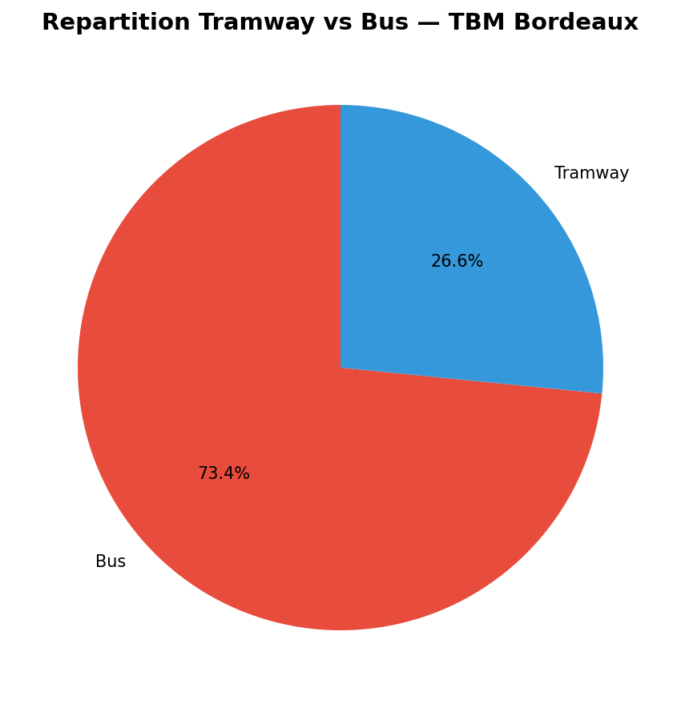

La prépondérance du bus (73,3 % des passages) reflète l'architecture du réseau : le tramway assure les liaisons structurantes sur les axes les plus fréquentés (centre-ville, gare, campus), tandis que le bus dessert capillairement l'ensemble de la métropole, y compris les zones périphériques à plus faible densité.

### 3.2 Analyse temporelle

#### Profil horaire

**Figure 2 — Nombre de passages programmés par heure sur une journée type.**

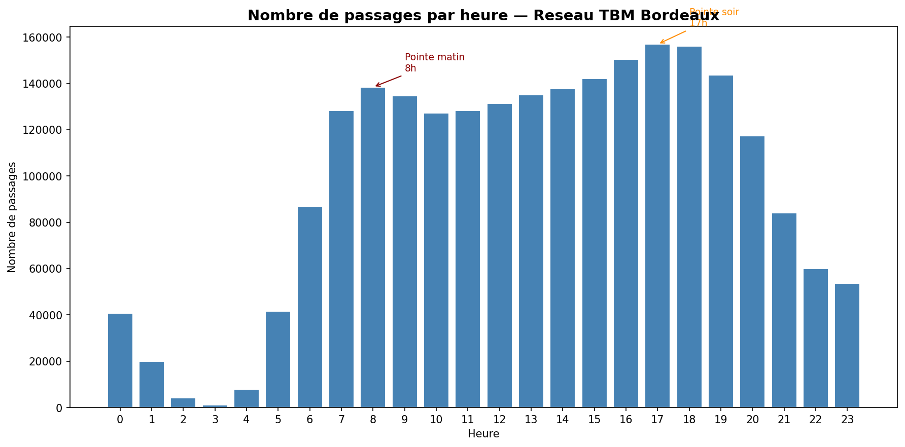

Le profil horaire des passages révèle deux pics caractéristiques des réseaux de transport urbain :

- **Pointe du matin à 8h** : 138 392 passages — correspondant aux flux domicile-travail et domicile-école
- **Pointe du soir à 17h** : 156 893 passages — légèrement plus intense que la pointe du matin
- **Heure la plus creuse à 3h** : 1 162 passages seulement, illustrant la quasi-interruption du service nocturne

Au total, **41,3 % des passages sont concentrés sur les tranches de pointe** (6h-8h et 16h-19h), ce qui représente une forte concentration temporelle de l'offre.

#### Tranches horaires

**Figure 3 — Passages programmés par tranche horaire.**

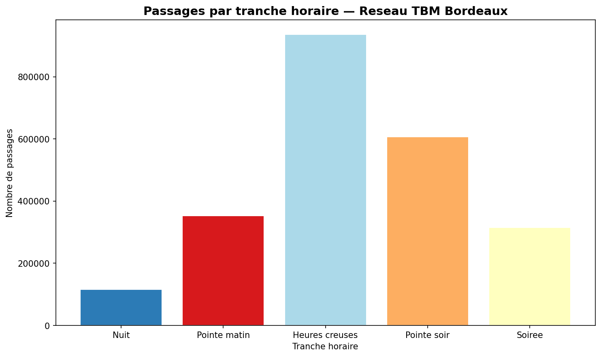

La répartition par tranche horaire confirme la domination des heures creuses de journée (40,2 % des passages entre 9h et 15h), suivies de la pointe soir (26,1 %) et de la pointe matin (15,2 %). La soirée (13,5 %) et la nuit (5,0 %) restent très minoritaires.

#### Comparaison semaine vs week-end

**Figure 4 — Comparaison de l'offre entre jours de semaine et week-end.**

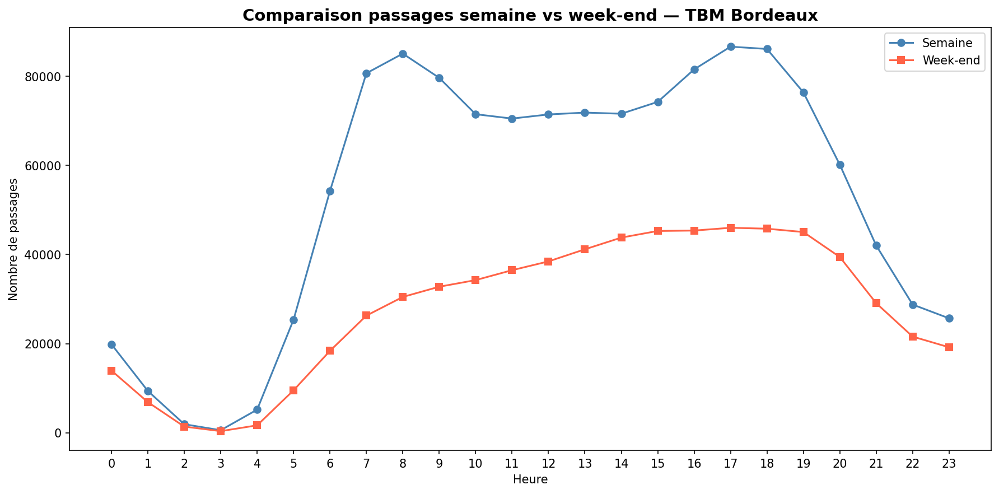

La réduction de desserte le week-end est significative : **-47,4 % de passages par rapport à la semaine**. Si les heures de pointe subsistent le samedi matin, le dimanche enregistre une offre très réduite tout au long de la journée. Ce déséquilibre pénalise les usagers qui ne disposent pas de véhicule personnel pour leurs déplacements du week-end.

#### Modélisation prédictive (optionnelle)

Dans une logique pédagogique, une modélisation prédictive simple a été ajoutée pour estimer l'affluence horaire à court terme à partir des tendances observées (variables temporelles, type de jour, retards). Un modèle linéaire de base (scikit-learn) a été entraîné sur une partition chronologique des données.

**Figure 4 bis — Prévision d'affluence horaire (baseline linéaire).**

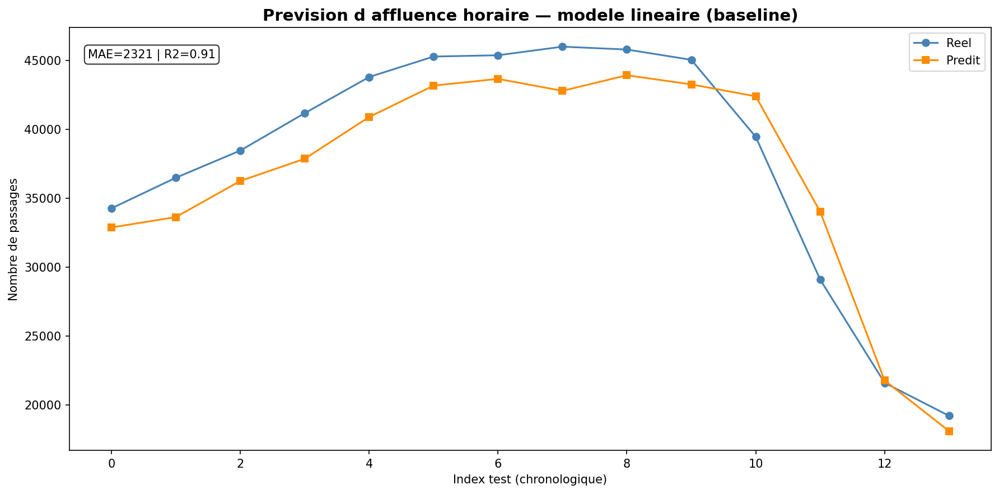

Sur l'échantillon de test, le modèle baseline obtient une **MAE de 2 321 passages** et un **R² de 0,91**. Le R² élevé indique que le modèle capte correctement la dynamique temporelle globale de l'offre horaire, tandis que la MAE rappelle qu'un écart absolu subsiste sur la valeur prédite à chaque point. En soutenance, ces résultats sont à présenter comme une **preuve de faisabilité méthodologique**, et non comme une prévision de fréquentation réelle des usagers.

Cette étape reste une première approche de démonstration : elle illustre la faisabilité de la prévision, mais les résultats doivent être interprétés avec prudence car les données GTFS décrivent l'offre planifiée et non la fréquentation réelle.

### 3.3 Analyse par ligne et par arrêt

#### Lignes les plus desservies

**Figure 5 — Top 15 des lignes les plus desservies du réseau TBM.**

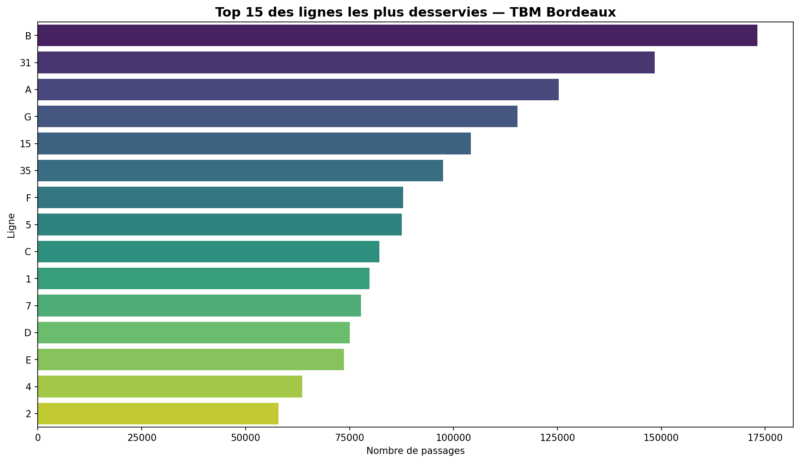

La ligne **B** est la plus desservie avec **173 103 passages**, suivie des lignes 31 (148 378), A (125 368), G (115 422) et 15 (104 125). Les lignes de tramway (A, B, C) figurent en tête, confirmant leur rôle structurant dans le réseau.

#### Lignes les moins desservies

**Figure 6 — Les lignes les moins desservies du réseau TBM.**

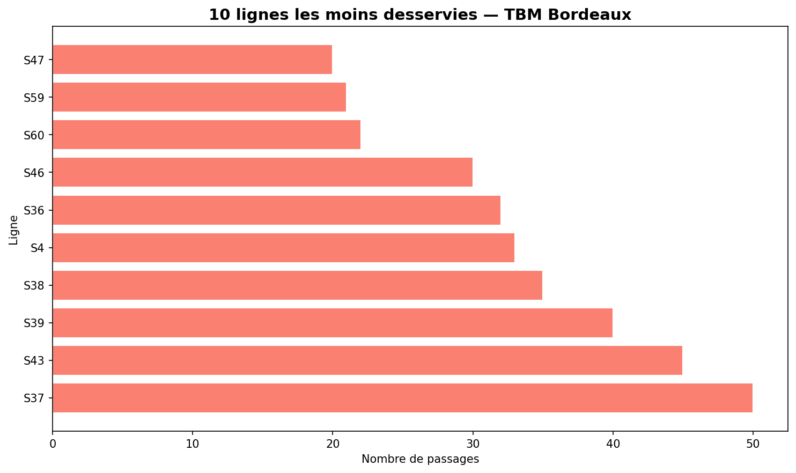

À l'autre extrémité du spectre, plusieurs lignes de la famille S (lignes saisonnières ou spéciales) enregistrent moins de 30 passages : S47 (20), S59 (21), S60 (22). Ces lignes correspondent probablement à des services ponctuels, scolaires ou à la demande.

#### Bus vs Tramway

**Figure 7 — Comparaison du profil horaire des passages entre bus et tramway.**

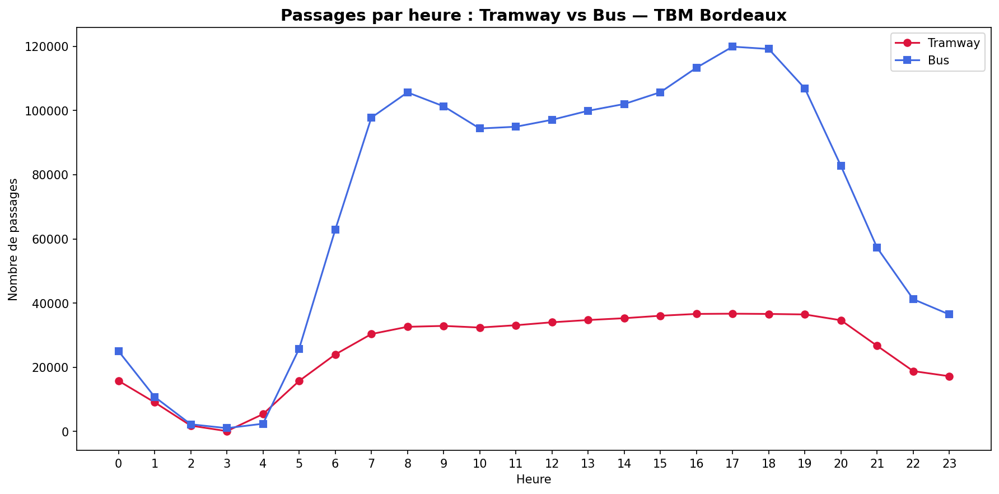

Le tramway suit un profil bimodal très marqué, avec des pics prononcés aux heures de pointe. Le bus présente un profil plus étalé, avec une desserte maintenue tout au long de la journée. Cet écart illustre la complémentarité structurelle entre les deux modes.

#### Arrêts les plus et moins desservis

**Figure 8 — Top 20 des arrêts les plus desservis.**

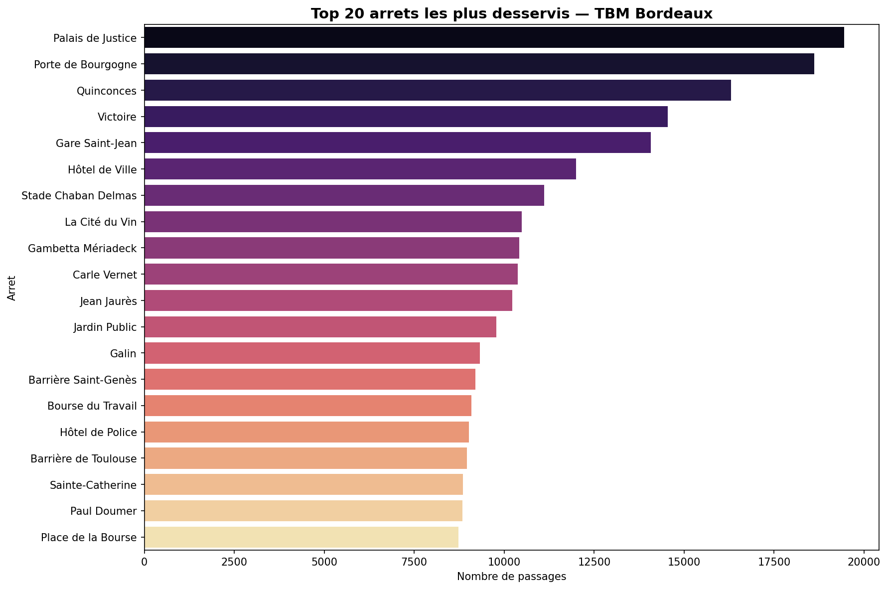

L'arrêt **Palais de Justice** est le plus fréquenté avec 19 444 passages, suivi de Porte de Bourgogne (18 614) et Quinconces (16 303). Ces arrêts correspondent aux grands nœuds de correspondance du centre historique de Bordeaux, où se croisent plusieurs lignes de tramway et de bus.

**Figure 9 — Les 20 arrêts les moins desservis.**

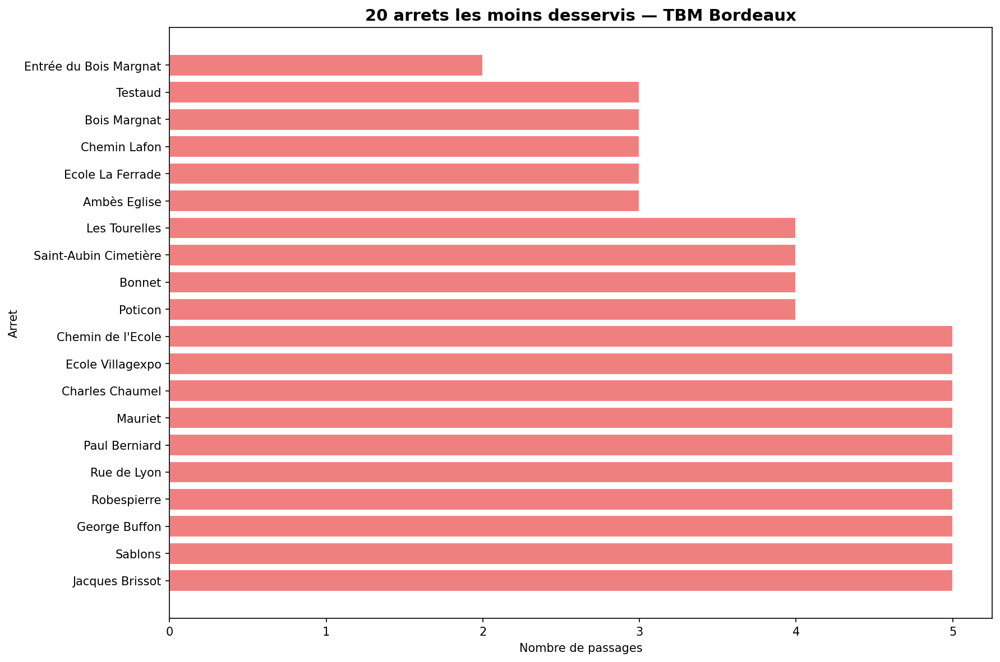

Les arrêts les moins desservis n'enregistrent que 2 à 5 passages, révélant des points du réseau à très faible couverture, situés probablement en périphérie ou sur des lignes spécialisées.

#### Heatmap lignes × heures

**Figure 10 — Heatmap de la fréquence de passage par ligne et par heure.**

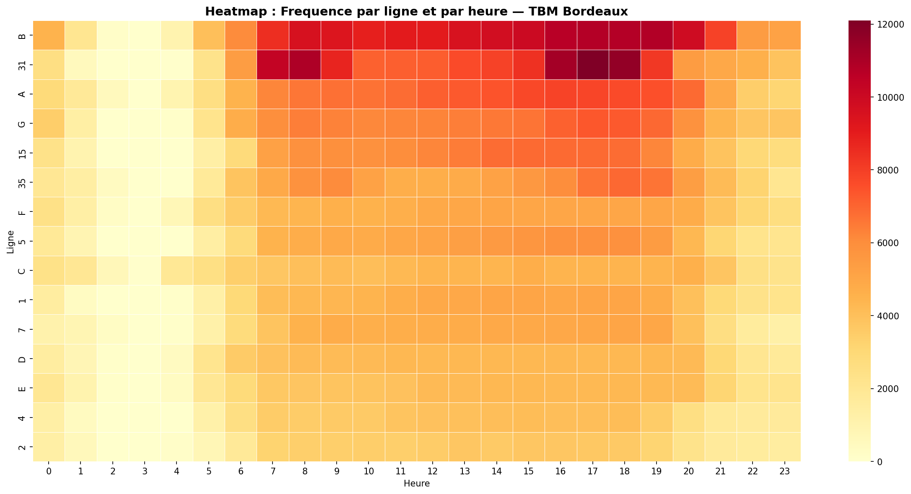

La heatmap confirme la forte concentration des passages aux heures de pointe pour les principales lignes. Certaines lignes (B, 31, A) maintiennent une activité élevée en continu, tandis que d'autres ne montrent d'activité que sur des plages restreintes.

---

## 4. Visualisations Géographiques

### 4.1 Carte des arrêts du réseau

**Figure 11 — Carte interactive des arrêts du réseau TBM.**

🗺️ **CARTE INTERACTIVE :** [Ouvrir la carte des arrêts TBM](data/output/carte_arrets_bordeaux.html)

La carte révèle une couverture géographique dense dans le centre de Bordeaux et le long des axes de tramway. Les zones périphériques présentent une densité d'arrêts nettement plus faible, desservies principalement par des lignes de bus. Les lignes de tramway (A, B, C) dessinent les grandes artères Est-Ouest et Nord-Sud de l'agglomération.

### 4.2 Heatmap de densité

**Figure 12 — Heatmap interactive de la densité de desserte.**

🗺️ **HEATMAP DENSITÉ :** [Ouvrir la heatmap de densité](data/output/heatmap_densite_bordeaux.html)

La heatmap de densité confirme la concentration des passages autour des arrêts du centre-ville (Palais de Justice, Quinconces, Victoire) et de la Gare Saint-Jean. Des zones moins desservies sont visibles en périphérie Nord et Est de la métropole.

### 4.3 Heatmap temporelle

**Figure 13 — Heatmap temporelle animée de l'offre.**

🗺️ **HEATMAP TEMPORELLE :** [Ouvrir la heatmap temporelle animée](data/output/heatmap_temporelle_bordeaux.html)

La heatmap temporelle illustre la dynamique de la desserte à travers la journée : le réseau démarre progressivement à partir de 5h, atteint son pic entre 7h et 9h, maintient une activité soutenue jusqu'à 19h, puis se réduit progressivement jusqu'à minuit.

### 4.4 Dashboards interactifs

**Figures 14a, 14b, 14c — Dashboards interactifs**

- 🗺️ **DASHBOARD CARTE :** [Ouvrir le dashboard carte des arrêts](data/output/dashboard_carte_arrets.html)
- 🗺️ **DASHBOARD HEURES :** [Ouvrir le dashboard passages par heure](data/output/dashboard_passages_heure.html)
- 🗺️ **DASHBOARD ARRÊTS :** [Ouvrir le dashboard top arrêts](data/output/dashboard_top_arrets.html)

Les trois dashboards Plotly permettent une exploration interactive des données :

- **Dashboard Carte** : visualisation des arrêts avec taille proportionnelle à la fréquence, colorés par type de transport, avec survol pour détail
- **Dashboard Heures** : histogramme interactif des passages par heure avec dégradé de couleur
- **Dashboard Top Arrêts** : classement des 20 arrêts les plus desservis avec filtrage possible

---

## 5. Recommandations

### 5.1 Problèmes identifiés

L'analyse des données met en évidence cinq problèmes structurels du réseau TBM :

**1. Surcharge aux heures de pointe** : 41,3 % des 2,3 millions de passages se concentrent sur les tranches de pointe définies dans l'analyse (6h-8h et 16h-19h, soit 7 heures au total). La ligne B seule enregistre 173 103 passages. Cette concentration horaire peut créer des risques de saturation et de dégradation de la qualité de service.

**2. Faible desserte nocturne** : 97 lignes sur 134 (72 %) ne fonctionnent plus après 22h, laissant de larges zones du territoire sans transport public en soirée.

**3. Déséquilibre semaine/week-end** : La desserte baisse de 47,4 % le week-end, ce qui pénalise massivement les usagers captifs (sans voiture).

**4. Arrêts mal connectés** : 696 arrêts ne sont desservis que par une seule ligne, ce qui rend toute correspondance impossible en cas d'incident.

**5. Lignes sous-utilisées** : Plusieurs lignes (S47, S59, S60) n'enregistrent que 20 à 22 passages sur l'ensemble de la période, questionnant leur pertinence en l'état.

### 5.2 Recommandations par ordre de priorité

| Priorité | Recommandation | Problème adressé | Impact estimé |
|----------|---------------|-----------------|---------------|
| 🔴 Haute | R1 — Renforcer la fréquence en pointe sur A, B, C | Saturation aux heures de pointe | Très élevé |
| 🔴 Haute | R2 — Étendre le service nocturne | 72 % des lignes arrêtent avant 22h | Élevé |
| 🟡 Moyenne | R3 — Améliorer la desserte week-end | -47 % de passages samedi/dimanche | Élevé |
| 🟡 Moyenne | R4 — Améliorer la connexion des arrêts mono-ligne | 696 arrêts isolés | Moyen |
| 🟢 Basse | R5 — Optimiser ou convertir les lignes très faibles | Efficience budgétaire | Faible/Long terme |

**R1 — Renforcer la fréquence en pointe (Haute priorité)**  
Le pic à 17h avec 156 893 passages indique une pression maximale sur les lignes B, 31 et A. Doubler la fréquence de passage sur ces lignes de 7h à 9h et de 16h à 19h permettrait d'absorber la demande supplémentaire, de réduire le temps d'attente moyen et d'améliorer significativement la ponctualité.

**R2 — Étendre le service nocturne (Haute priorité)**  
Avec 97 lignes inactives après 22h, Bordeaux Métropole présente un déficit notable d'offre nocturne. La création de 5 lignes "Liane noctambule" sur les axes principaux (Tramway A+B + 4 lignes de bus structurantes) jusqu'à 1h du matin répondrait aux besoins des travailleurs décalés et de l'économie nocturne.

---

## 6. Limites et Perspectives

### 6.1 Limites

- **Données GTFS = offre théorique** : le nombre de passages reflète les horaires planifiés, non la fréquentation réelle. Un bus quasi-vide génère autant de "passages" qu'un bus bondé.
- **Absence de données de billettique** : sans validations de titres, la charge réelle des véhicules et les origines-destinations des voyageurs restent inconnues.
- **Absence de données temps réel** : retards, suppressions et modifications de service ne sont pas pris en compte — l'analyse porte sur le réseau théorique idéal.
- **Périmètre géographique** : l'analyse est limitée aux données TBM et ne couvre pas les connexions avec d'autres réseaux (TER, Covoiturage, etc.).
- **Granularité arrêt** : l'absence de données socio-démographiques (densité, revenus, mobilité) empêche de croiser la desserte avec les besoins réels des populations.

### 6.2 Perspectives

- **Intégration des données de billettique** TBM pour mesurer la fréquentation réelle
- **Croisement avec les données démographiques INSEE** (population par IRIS, zones d'emploi)
- **Utilisation de l'API GTFS-RT** (temps réel) pour analyser la ponctualité et les aléas
- **Modélisation prédictive** de la demande par machine learning
- **Benchmarking** avec d'autres réseaux métropolitains français (Nantes, Lyon, Toulouse)

---

## 7. Conclusion

Ce projet a démontré la richesse analytique des données GTFS pour comprendre le fonctionnement d'un réseau de transport public. À partir de 2,3 millions d'enregistrements de passages, nous avons pu établir un portrait détaillé du réseau TBM Bordeaux.

Les résultats clés sont les suivants :

- **41,3 % des passages** se concentrent sur les tranches de pointe (6h-8h et 16h-19h, soit 7 heures), révélant un réseau encore fortement dimensionné pour le modèle domicile-travail
- **72 % des lignes** (97 sur 134) s'arrêtent avant 22h, limitant l'accessibilité nocturne
- **-47,4 % de desserte** le week-end, pénalisant les usagers captifs
- **696 arrêts** (40 % du total) ne sont couverts que par une seule ligne
- L'arrêt **Palais de Justice** est un hub stratégique avec 19 444 passages

L'approche data-driven appliquée ici offre aux décideurs de TBM des leviers concrets d'action, fondés non sur des intuitions mais sur des faits chiffrés et objectivables. Deux recommandations prioritaires se dégagent : renforcer la fréquence sur les axes principaux aux heures de pointe, et étendre significativement le service nocturne.

À terme, l'enrichissement de cette analyse avec des données de billettique et des indicateurs socio-économiques permettrait de passer d'une analyse de l'offre à une analyse de l'adéquation offre/demande — condition indispensable à une véritable optimisation du service public de mobilité.

---
